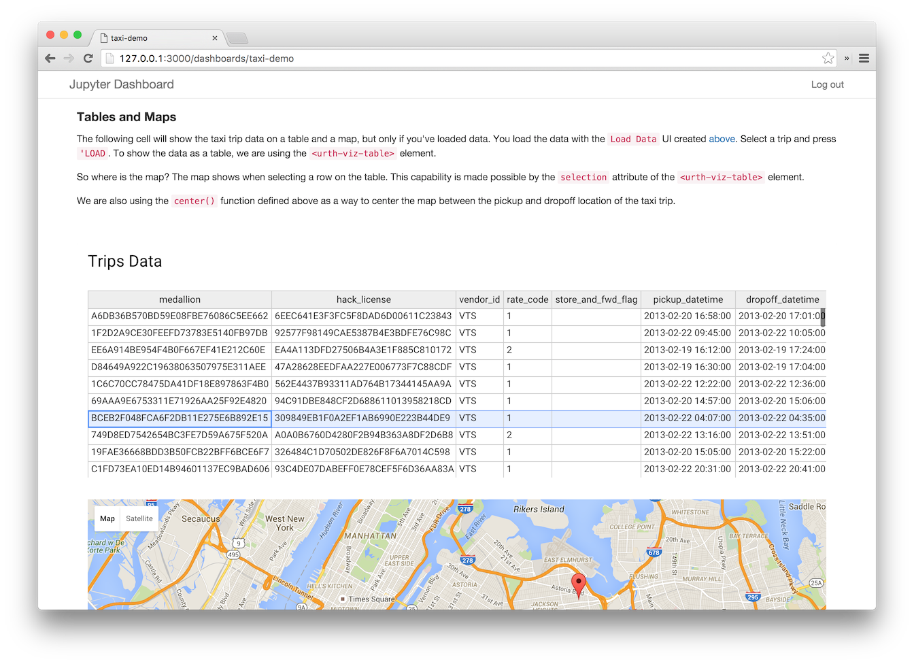
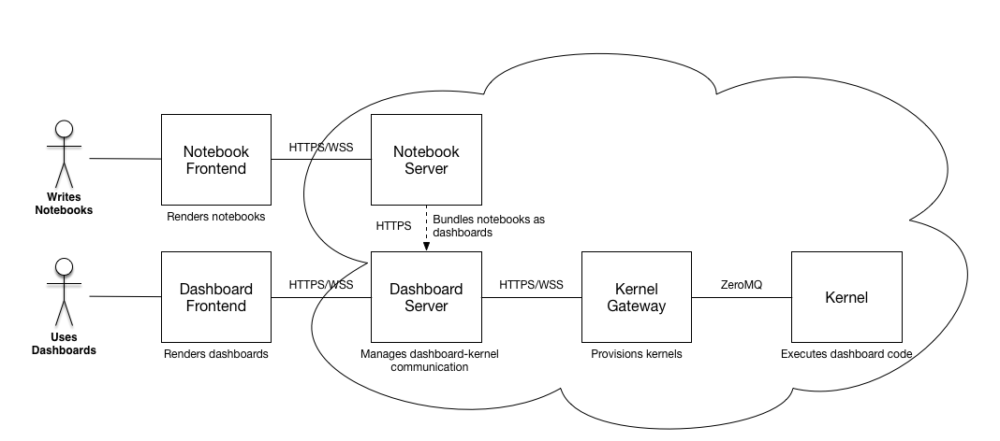

[](https://travis-ci.org/jupyter-incubator/dashboards_server) [](https://groups.google.com/forum/#!forum/jupyter)

# Jupyter Dashboards Server

A NodeJS application that can display Jupyter notebooks as dynamic dashboards outside of the Jupyter Notebook server.



This repository is a portion of the `jupyter-incubator/dashboards` effort which covers:

* [Arranging](https://github.com/jupyter-incubator/dashboards) notebook outputs in a grid-layout
* [Bundling](https://github.com/jupyter-incubator/dashboards_bundlers) notebooks and associated assets for deployment as dashboards
* [Serving](https://github.com/jupyter-incubator/dashboards_server) notebook-defined dashboards as standalone web apps (**this repo**)

It is also has close ties to [jupyter-incubator/declarativewidgets](https://github.com/jupyter-incubator/declarativewidgets) which provides one way (but not the only way) of enabling rich interactivity in notebook-defined dashboards.

## What it Gives You

* Ability to run a Jupyter Notebook with [layout metadata](https://github.com/jupyter-incubator/dashboards) as a standalone dashboard application
* Ability to navigate a list of multiple notebooks and select one to run as a dashboards
* Optional shared login to secure access to the dashboard server
* Ability to add custom authentication mechanisms using the [Passport](http://passportjs.org/) middleware for Node.js
* API for POSTing notebooks to the server at runtime with optional authentication (`/_api/notebooks`)

The behavior of the application is similar to that of [Thebe](https://github.com/oreillymedia/thebe), but with some key technical differences:

* The notebook code is visible only in the NodeJS application backend.
* The NodeJS backend is the only actor that can send notebook code to a kernel for execution.
* The browser client can only send [Jupyter comm messages](http://jupyter-client.readthedocs.org/en/latest/messaging.html#opening-a-comm) to kernels (*not* arbitrary code).
* The application uses the [jupyter-js-services](https://github.com/jupyter/jupyter-js-services) and [jupyter-js-widgets](https://github.com/ipython/ipywidgets/tree/master/jupyter-js-widgets) libraries for communication with kernels.

The following libraries are known to work with the dashboard server:

* jupyter_dashboards 0.5.x
* jupyter_dashboards_bundlers 0.7.x 
* ipywidgets 5.x
* jupyter_declarativewidgets 0.5.x
* Bokeh 0.11.x
* Plotly 1.9.x

## Try It

If you want to see the dashboard server in action, you can run a handful of demos we included in this project in a Docker container. After setting up Docker (e.g. using [docker-machine](https://docs.docker.com/machine/get-started/)), do the following in a git clone of this repo:

```
make build
make examples
make demo-container
```

Open your web browser and point it to the dashboards server running on your Docker host at `http://<docker host ip>:3000/`.

## Deploy It

The dashboard server is meant to enable the following workflow:

1. Alice authors a notebook document using Jupyter Notebook.
2. Alice adds a dashboard layout to her notebook using the `jupyter_dashboards` extension.
3. Alice [associates required frontend assets](https://github.com/jupyter-incubator/contentmanagement/blob/master/etc/notebooks/associations_demo/associations_demo.ipynb) with her notebook.
4. Alice one-click deploys her notebook and associated assets to a `jupyter_dashboards_server` using `jupyter_dashboards_bundlers`.
5. Bob visits the dashboards server.
6. Bob interacts with Alice's notebook as a dashboard.
7. Alice updates her notebook and redeploys it to the dashboards server.

This workflow requires multiple components working in concert like so:



To bring all of these pieces together, start with the [`docker-compose` recipe outlined in this gist](https://gist.github.com/parente/527cea0481afe9fabbcd). Modify it to suit your needs, or bring your own DevOps tooling to bear. (We'll gladly take PRs that reduce the complexity of getting everything set up!)

See the [dashboards deployment roadmap](https://github.com/jupyter-incubator/dashboards/wiki/Deployment-Roadmap) for additional use cases and potential deployments.

## Develop It

You can use the Try It setup above for development, but any change you make to the source will require a restart of the dashboard server container. A better approach is to install the following on your host machine:

* Node 5.5.0
* npm 3.5.3
* gulp 3.9.0
* Docker 1.9.1
* Docker Machine 0.5.6

With these installed, you can use the `make dev-*` targets. Under the covers, these targets use `gulp` to automatically rebuild and restart the dashboard server any time you make a code change. Run `make help` to see the full gamut of targets and options. See the next few sections for the most common patterns. Of course, you can mix and match.

### Setup

```bash
# re-run if the Dockerfile.kernel changes
make kernel-gateway-image
# re-run if package.json changes
make dev-install
# run if you want to try the preliminary jupyter-incubator/declarativewidgets support
make examples
```

### Dashboard Server w/ Auto Restart

```bash
make dev
# mac shortcut for visiting URL in a browser
open http://127.0.0.1:3000
```

### Dashboard Server w/ Auto Restart and Debug Console Logging

```bash
make dev-logging
# mac shortcut for visiting URL in a browser
open http://127.0.0.1:3000
```

### Dashboard Server w/ Auto Restart and Remote Debugging

```bash
npm install -g node-inspector
make dev-debug
# a browser tab should open with the debugger visible
# refresh if it errors: the server might not be running yet
```

### Dashboard Server w/ Auto Restart and Form Auth

```bash
make dev USERNAME=admin PASSWORD=password
# mac shortcut for visiting URL in a browser
open http://127.0.0.1:3000
```

See the [Authentication](https://github.com/jupyter-incubator/dashboards_server/wiki/Authentication) wiki page for information about configuring alternative authentication mechanisms.

### Dashboard Server w/ Auto Restart and Self-Signed HTTPS Certificate

```bash
make certs
make dev HTTPS_KEY_FILE=certs/server.pem HTTPS_CERT_FILE=certs/server.pem
# mac shortcut for visiting URL in a browser
open https://127.0.0.1:3001
```

### Dashboard Server Tests

```bash
# unit tests
make test
# backend integration tests
make integration-test
```

## Detailed Developer Documentation

* [Server API](https://github.com/jupyter-incubator/dashboards_server/wiki/Server-API) - server endpoints
    - Also contains information about **bundled dashboards** (allowing specification of external resources).
* [Authentication](https://github.com/jupyter-incubator/dashboards_server/wiki/Authentication) - examples of integrating 3rd-party authentication strategies
